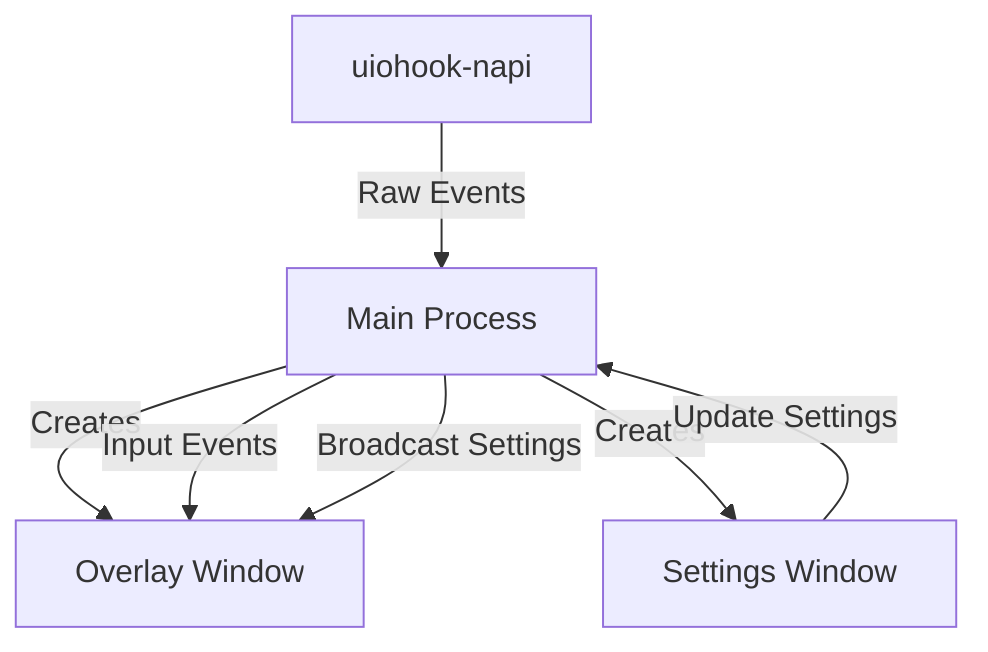

# Architecture

## Overview

Kika uses a standard Electron architecture with a Main process and a Renderer process.

## Components

### 1. Main Process (`src/main/`)

- Entry point: `index.js`
- Manages `BrowserWindow` instances:
  - **Overlay Window**: The transparent, always-on-top window for the cat.
  - **Settings Window**: The configuration UI.
- Handles global input hooks via `uiohook-napi`.
- Manages application state (input counts) and persistence (electron-store).

### 2. Renderer Process (`src/renderer/`)

- **Overlay** (`renderer/overlay/`):
  - Renders the cat sprites.
  - Listen for state changes (idle, active, hit).
- **Settings** (`renderer/settings/`):
  - Provides UI for configuration.
  - Communicates with Main process to update preferences.

### 3. IPC Layer (`src/main/ipc/`)

- Handles communication between Main and Renderer processes.
- **Channels**:
  - `input:event`: Sends key/mouse events to overlay.
  - `settings:update`: Renderer -> Main (Save settings).
  - `settings:changed`: Main -> Renderer (Broadcast updates).
  - `reset-settings`: Reset to defaults.
  - `overlay:enable-click-through` / `overlay:disable-click-through`.
  - `overlay:dragEnd`: Notify main process of new position.
  - `overlay:resetPosition`: Reset position to preset.
